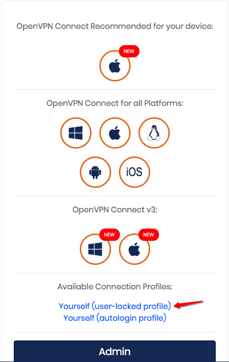

# Overview
(R)emote (S)oftware (C)ommunications (S)ystem is a lightweight Raspberry Pi Flask server for streaming video to the browser and mapping post requests to serial instructions. This system is built to interface with a remotely controlled bot armed with disinfectant pumps to be deployed in a commercial setting. This project is deployed with a custom VPN server to allow flexibility in connecting bots with remote operators from any location with an internet connection. 

## Running the APP
`export FLASK_APP=App.py`

For localhost:
`flask run`

For Externally Visible Server
`flask run --host=0.0.0.0`

## Installation
If OpenCV fails to install with `pip install -r requirements.txt`, try:
`pip install opencv-contrib-python==4.1.0.25 --no-cache-dir`

## Backing Up + Restoring Pi Image:
* OSX: https://pimylifeup.com/backup-raspberry-pi/
* Linux: https://www.raspberrypi.org/forums/viewtopic.php?t=46911

## VPN Setup
### Shutting down the VM
* SSH into the VM instance
* run `sudo poweroff`

### Administrator Access
Starting the VPN:
* Contact support and request Administrative access, you will have to give them your public IP address. Support will whitelist your IP and send you the `VPN URL`, `admin user name` and temporary `password`. 
* Visit the `VPN URL`/`admin` page and log in with your credentials.
* Go to User `Management > User Permissions` and select the `More settings` button next to your `admin user name`. Change your password to something secure, select `Save Settings`.
* Once the page reloads hit `Update Running Server`.
* Now, visit the `VPN URL`, and download your user locked client config file.
* Also visit the link and download the `OpenVPN Connect` for your OS.

* Follow the instructions for connecting to your VPN through `OpenVPN Connect`. You will need your `VPN URL`, `user name`, and `password`.
* You now should be connected to the VPN!

### Registering Bots
* With an Admin account, log into the `VPN Admin` interface.
* Create a new user called `bot[n]` where `[n]` is some unused suffix for existing bots on the VPN with the following Permissions checked/selected:
  * `No Default Group`
  * `Allow Auto Login`
* Select `More Settings` and:
  * Give the bot a static IP address of the form: `10.0.0.10[n]`
  * Check the `all server-side private subnets` box
  * Check the `all other VPN clients` box
* Hit `Save Settings`
* Once the page reloads hit `Update Running Server`.
* Now, visit the `VPN URL`, and login with the credentials for the bot user you just created and download the autologin client config file.
* rename the file to `bot-client.ovpn`
* `SCP` the config file into the Bot's `home` directory.
* Whitelist the Bot's Public IP Address in Google Cloud (Contact support if neccessary)
* Reboot the Bot
* The Bot should now be accessible in the VPN at `10.0.0.10[n]`

#### Time out of sync
If the bot is having trouble connecting to the VPN,
Try running: `sudo date -s "$(wget -qSO- --max-redirect=0 google.com 2>&1 | grep Date: | cut -d' ' -f5-8)Z"`
***This will likely be taken care of in the .bashrc file***

#### More info:
* `nohup sudo openvpn --config bot-client.ovpn &`
* [Connecting To Access Server With Linux](https://openvpn.net/vpn-server-resources/connecting-to-access-server-with-linux/)
  
### Registering Remote Operators
* Contact support and request Administrative access, you will have to give them your public IP address. Support will whitelist your IP and send you the `VPN URL`, `user name` and temporary `password`. 
* Visit the `VPN URL` page and log in with your credentials.
* Once logged in, select `Change Password`, and update your password.
* Once the page reloads hit `Update Running Server`.
* Now, visit the `VPN URL`, and download your user locked client config file.
* Also visit the link and download the `OpenVPN Connect` for your OS.
* Follow the instructions for connecting to your VPN through `OpenVPN Connect`. You will need your `VPN URL`, `user name`, and `password`.
* You now should be connected to the VPN!

## NGINX
* Start manually: `uwsgi --ini /home/pi/RSCS/uwsgi_config.ini`
* viewing error logs `tail -f /var/log/nginx/access.log`

more info: 
* https://www.raspberrypi-spy.co.uk/2018/12/running-flask-under-nginx-raspberry-pi/
* https://iotbytes.wordpress.com/python-flask-web-application-on-raspberry-pi-with-nginx-and-uwsgi/

## Known Issues:
Problems with `systemd`:
This stack post helped to solve https://raspberrypi.stackexchange.com/questions/103458/cant-use-sudo-systemctl-start-myservice/113933#113933

